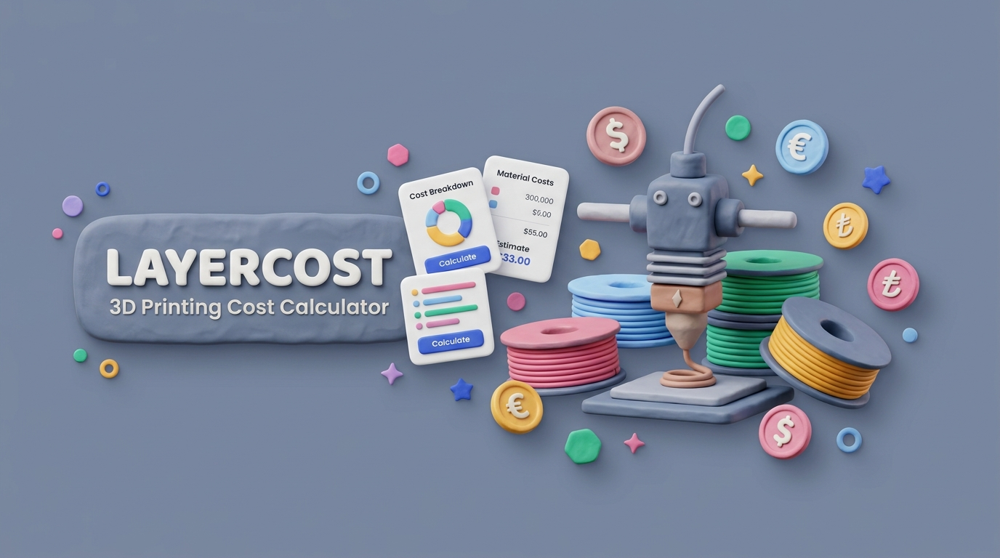

<div align="center">



<br />

# LayerCost

### Tactile 3D Printing Cost & Pricing Calculator PWA

[](https://react.dev/)
[](https://www.typescriptlang.org/)
[](https://vitejs.dev/)
[](https://tailwindcss.com/)
[](https://web.dev/progressive-web-apps/)
[](./LICENSE)

**LayerCost** is a modern, offline-first Progressive Web App (PWA) built for makers, 3D printing hobbyists, and print farm businesses. It computes precise material, electricity, depreciation, labor, failure risk, and profit margins with instant real-time feedback and a delightful, tactile **Claymorphism (Clay 3D)** user experience.

[Features](#-key-features) • [Formulas](#-cost-formulas) • [Tech Stack](#-tech-stack) • [Quick Start](#-quick-start) • [Project Structure](#-project-structure) • [License](#-license)

</div>

---

## ✨ Key Features

- 🎨 **Authentic Claymorphism UI/UX**: Soft 3D extruded surfaces, inset cavity inputs, tactile physical pressable buttons, step adjusters (`+ / -`, `+10g`, `+15 min`), and smooth pill toggles.
- 🌓 **Dual Themes (Light & Dark Clay)**:
  - **Light Mode**: Warm porcelain clay palette with soft pillowy cards and subtle blue-gray inner cavity shadows.
  - **Dark Mode**: Deep charcoal matte clay palette with soft neon ambient reflections.
  - One-click instant theme toggle with zero-flash early initialization.
- 🌍 **Multilingual Support (4 Languages)**:
  - 🇹🇷 **Türkçe (TR)**
  - 🇬🇧 **English (EN)**
  - 🇩🇪 **Deutsch (DE)**
  - 🇫🇷 **Français (FR)**
  - Includes smart browser language auto-detection and localized date/number formatters.
- 💱 **Real-Time Live Exchange Rate Engine**:
  - Automatically fetches live currency rates (`open.er-api.com`) with localStorage caching and offline fallbacks.
  - Seamless live conversion across `TRY (₺)`, `USD ($)`, `EUR (€)`, and `GBP (£)` for all monetary inputs simultaneously.
- ⚙️ **Tactile Settings Modal (`SettingsModal.tsx`)**:
  - Centralized management for Themes, Languages, Currencies, Live Rate status, PWA App installation, and Factory Reset.
  - Keeps the top header minimal, clean, and distraction-free.
- ⚡ **Instant Real-Time Calculations**: Every parameter adjustment instantly recalculates base cost, failure buffer, markup, and hourly unit prices.
- 🧵 **Extensive Hardware & Filament Presets**:
  - **Printers**: Anycubic (Kobra S1, Kobra 3 Combo, Kobra 2 Pro, Kobra 2 Neo, Photon Mono M5s), Bambu Lab (X1C, P1S, A1, A1 Mini), Creality (Ender 3 V3, K1 Max), Prusa (MK4S), Elegoo (Neptune 4 Pro).
  - **Filaments**: PLA, PLA+, PETG, ABS, TPU, ASA, Carbon Fiber PLA, UV Resin with automatic spool usage meters.
- 🎛️ **Custom 3D Dropdowns (`ClaySelect.tsx`)**:
  - Custom tactile extruded dropdowns replacing flat native browser selects, with studio-shadowed floating menus and technical power/cost badges.
- 📊 **3D Cylindrical Cost Breakdown**: Visual segmented cylinder bar chart and tactile stat cushions breaking down every cost component.
- 📜 **Formula Transparency (`FormulaBreakdown.tsx`)**: Built-in interactive formula table detailing step-by-step arithmetic for client transparency.
- 💾 **Profile Management & JSON Backup**: Save custom print configurations to `localStorage`, switch between profiles, and export/import JSON backups.
- 📄 **Printable Quotation & PDF Generator**: Generate clean, professional quotations (`window.print()`) with optional toggles for internal company cost breakdowns.
- 📱 **Mobile-First Responsive UX**:
  - Segmented top tab switcher (`MobileTabNav.tsx`) for fast parameter and result switching on smaller screens.
  - Floating sticky bottom price bar (`MobileBottomBar.tsx`) providing one-tap navigation to results and PDF quote exports.
- 🚀 **CI/CD & Release Automation**: GitHub Actions for linting/building with Node 22, Dependabot security updates, automated GitHub Pages deployment, and Release Please v4 automated changelogs.

---

## 📐 Cost Formulas

LayerCost uses an industry-standard additive manufacturing costing algorithm:

### 1. Material (Filament) Cost
$$\text{Cost}_{\text{filament}} = \left(\frac{\text{Spool Price}}{\text{Spool Weight (g)}}\right) \times \text{Print Weight (g)}$$

### 2. Electricity Cost
$$\text{Cost}_{\text{electricity}} = \left(\frac{\text{Printer Power (W)}}{1000}\right) \times \text{Print Time (hours)} \times \text{Electricity Rate (kWh)}$$

### 3. Machine Depreciation (Wear & Tear)
$$\text{Cost}_{\text{depreciation}} = \left(\frac{\text{Printer Purchase Price}}{\text{Printer Lifespan (hours)}}\right) \times \text{Print Time (hours)}$$

### 4. Labor Cost
$$\text{Cost}_{\text{labor}} = \left(\frac{\text{Labor Time (minutes)}}{60}\right) \times \text{Hourly Labor Rate}$$

### 5. Base Manufacturing Cost
$$\text{Cost}_{\text{base}} = \text{Cost}_{\text{filament}} + \text{Cost}_{\text{electricity}} + \text{Cost}_{\text{depreciation}} + \text{Cost}_{\text{labor}} + \text{Extra Consumables}$$

### 6. Risk-Adjusted Cost (Failure Buffer)
$$\text{Cost}_{\text{risk}} = \text{Cost}_{\text{base}} \times \left(1 + \frac{\text{Failure Rate (\%)}}{100}\right)$$

### 7. Final Recommended Sale Price
$$\text{Price}_{\text{final}} = \text{Cost}_{\text{risk}} \times \left(1 + \frac{\text{Profit Margin (\%)}}{100}\right)$$

---

## 🛠️ Tech Stack

| Technology | Purpose |
|---|---|
| **React 19** | Modern declarative UI component architecture |
| **TypeScript 5.7** | Strict type safety with `verbatimModuleSyntax` |
| **Vite 6** | Lightning-fast development server & optimized production bundler |
| **Tailwind CSS v4** | Next-generation utility engine with custom Clay design tokens |
| **vite-plugin-pwa** | Service worker generation, offline caching & Web App Manifest |
| **Lucide React** | Clean, consistent icons for UI controls and visual badges |

---

## 🚀 Quick Start

### Prerequisites
- Node.js `20.0.0` or `22.0.0`
- npm `9.0.0` or higher (or pnpm / yarn / bun)

### Installation

1. **Clone the repository:**
   ```bash
   git clone https://github.com/AtaCanYmc/layer-cost.git
   cd layer-cost
   ```

2. **Install dependencies:**
   ```bash
   npm install
   ```

3. **Start the local development server:**
   ```bash
   npm run dev
   ```
   Open your browser at `http://localhost:5173`.

---

## 📜 Available Scripts

| Command | Action |
|---|---|
| `npm run dev` | Starts Vite local development server with Hot Module Replacement (HMR) |
| `npm run build` | Runs TypeScript typecheck (`tsc -b`) and generates production bundle in `dist/` |
| `npm run preview` | Locally serves the production build for testing |
| `npm run lint` | Runs ESLint across all TypeScript and React files |

---

## 📁 Project Structure

```text
layer-cost/
├── .github/
│   ├── dependabot.yml           # Automated dependency update configuration
│   └── workflows/
│       ├── ci.yml               # Automated lint & build verification
│       ├── deploy.yml           # GitHub Pages deployment workflow
│       └── release-please.yml   # Release Please automated versioning
├── public/                      # Static PWA assets, icons, manifest
│   ├── banner.png               # 3D Clay product banner
│   ├── logo.png                 # 3D Clay product logo
│   ├── favicon.svg              # App favicon
│   ├── site.webmanifest         # PWA web manifest
│   ├── pwa-192x192.svg          # PWA icon (192px)
│   └── pwa-512x512.svg          # PWA icon (512px)
├── docs/                        # Documentation assets
│   ├── banner.png
│   └── logo.png
├── src/
│   ├── components/              # React components
│   │   ├── ui/                  # Atomic SOLID Clay UI Kit
│   │   │   ├── ClayCard.tsx         # Extruded 3D container card
│   │   │   ├── ClayHeader.tsx       # Section header with preset select
│   │   │   ├── ClayInputField.tsx   # Labeled input with unit & hints
│   │   │   ├── ClaySelect.tsx       # Custom 3D tactile dropdown
│   │   │   ├── ClaySliderField.tsx  # Touch-friendly slider with margin pills
│   │   │   └── ClayStepperField.tsx # Touch stepper controls
│   │   ├── CostBreakdownChart.tsx   # 3D cylindrical segmented bar chart
│   │   ├── FilamentSection.tsx      # Spool price, weight, type selectors
│   │   ├── FormulaBreakdown.tsx     # Step-by-step formula transparency table
│   │   ├── Header.tsx               # Minimal top brand & action bar
│   │   ├── LaborSection.tsx         # Post-processing time, wage & extra costs
│   │   ├── MobileBottomBar.tsx      # Sticky floating price bar for mobile
│   │   ├── MobileTabNav.tsx         # Segmented mobile parameter/results switcher
│   │   ├── PricingRiskSection.tsx   # Failure buffer, profit markup & client info
│   │   ├── PrinterSection.tsx       # Power, slicer time, depreciation & presets
│   │   ├── QuoteExportModal.tsx     # Printable PDF quotation sheet
│   │   ├── ResultsOverview.tsx      # Hero sale card & cost cushions
│   │   ├── SavedProfilesModal.tsx   # Profile templates & JSON import/export
│   │   └── SettingsModal.tsx        # Centralized settings (Theme, Lang, Currency, PWA)
│   ├── data/
│   │   └── presets.ts           # Benchmark printer and filament catalog
│   ├── i18n/
│   │   └── translations.ts      # TR, EN, DE, FR translation dictionaries
│   ├── types/
│   │   └── calculator.ts        # TypeScript interfaces and data models
│   ├── utils/
│   │   ├── calculator.ts        # Mathematical costing & formatting algorithms
│   │   └── currency.ts          # Real-time exchange rate engine
│   ├── App.tsx                  # Main application orchestrator
│   ├── main.tsx                 # React DOM root entry point
│   └── index.css                # Tailwind v4 styles & Claymorphism utility classes
├── release-please-config.json   # Release Please configuration
├── .release-please-manifest.json# Release Please version tracker
├── vite.config.ts               # Vite & PWA build configuration
└── package.json                 # Project dependencies and npm scripts
```

---

## 🤝 Contributing

Contributions, issues, and feature requests are welcome! Feel free to check the [Contributing Guide](./CONTRIBUTING.md).

1. Fork the Project
2. Create your Feature Branch (`git checkout -b feature/AmazingFeature`)
3. Commit your Changes (`git commit -m 'feat: Add some AmazingFeature'`)
4. Push to the Branch (`git push origin feature/AmazingFeature`)
5. Open a Pull Request

---

## 🔒 Security

For security vulnerabilities and reporting, please refer to [SECURITY.md](./SECURITY.md).

---

## 📄 License

Distributed under the **MIT License**. See [`LICENSE`](./LICENSE) for more information.

<div align="center">
  <sub>Built with ❤️ for the 3D Printing & Maker Community.</sub>
</div>
